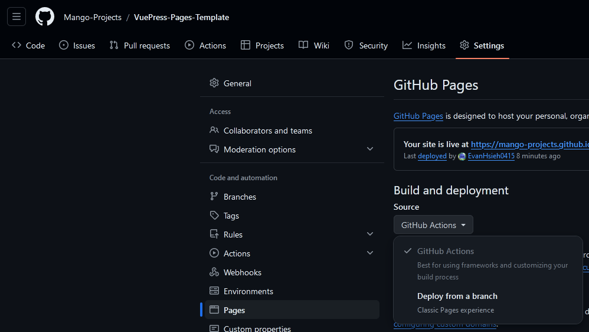

# VuePress-Pages-Template

## Setup

1. Change `packages.json`
   1. `"name"`
   2. `"description"`
   3. `"repository"`

2. Change Github Repository Settings
   1. Settings > Pages > Build and deployments > Source > Github Action
   